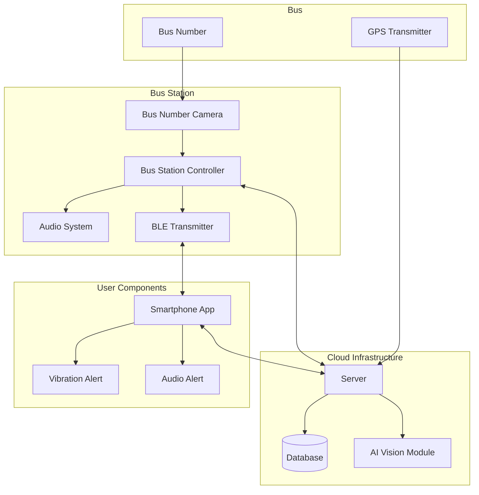

```mermaid
flowchart TD
    subgraph "Bus"
        BGPS[GPS Transmitter]
        BID[Bus Number]
    end

    subgraph "Bus Station"
        CAM[Bus Number Camera] --> LC[Bus Station Controller]
        LC --> AS[Audio System]
        LC --> BLE[BLE Transmitter]
    end

    subgraph "Cloud Infrastructure"
        CS[Server] --> DB[(Database)]
        CS --> AI[AI Vision Module]
    end

    subgraph "User Components"
        MOB[Smartphone App] --> VIB[Vibration Alert]
        MOB --> UA[Audio Alert]
    end

    BGPS --> CS
    BID --> CAM

    LC <--> CS
    MOB <--> CS
    BLE <--> MOB
```
